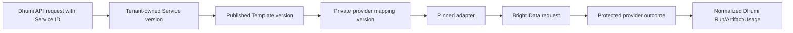

# Dhumi Public API

## Contract status

`PLATFORM-DECISION`

The current accepted Demo Production HTTP contract is
[openapi.yaml](openapi.yaml), with 27 operations. It includes four accepted
Marketplace sample/enquiry additions to the original 23-operation surface.
The older Project Specs YAML is a retained snapshot, not client-generation
authority. The current contract is intentionally smaller than the older platform
API: there are no activation, plan, subscription, billing, quota, invite,
membership or customer-webhook routes. Acceptance does not enable live Bright
Data traffic; launch gates still control provider egress.

The OpenAPI document is the machine contract. This file explains behavior and does not silently add routes or fields.

## API rules

- Base path: `/v1`.
- JSON property names: `snake_case`.
- Browser clients use a short-lived Dhumi access token/session plus CSRF protection on state-changing browser requests.
- Programmatic clients use a Dhumi-issued Bearer API key.
- A customer never supplies `tenant_id` in a normal customer request.
- All collection endpoints use opaque cursor pagination with bounded `limit`.
- All accepted asynchronous runs return `202` and a Dhumi `run_id`.
- Mutating create/action requests declare `Idempotency-Key` where the contract requires it.
- Errors use `application/problem+json` with a stable Dhumi code and `request_id`.
- Responses never contain a Bright Data key, provider dataset ID, snapshot ID, zone or raw provider error.

## Endpoint groups

### Authentication

| Method | Path | Purpose | Provider call |
|---|---|---|---|
| `POST` | `/v1/auth/signup` | Create local User, Tenant and owner Tenant Access; generic accepted response | Never |
| `POST` | `/v1/auth/sign-in` | Authenticate a User and create session/token family | Never |
| `POST` | `/v1/auth/refresh` | Rotate/refresh Dhumi session | Never |
| `POST` | `/v1/auth/logout` | Revoke current Dhumi session family | Never |

`PENDING-VERIFICATION`: production public email-ownership verification, MFA enrollment/recovery and account-recovery policy must be approved before unrestricted public signup. The demo may run with allowlisted users until those routes are versioned.

Signup returns `409` only for `IDEMPOTENCY_CONFLICT` (the same
`Idempotency-Key` with a different canonical request). An existing email follows
the generic `202` flow and must not be exposed as a duplicate-email conflict.

Refresh reads the HttpOnly cookie and required `X-CSRF-Token`, preserves the
session's absolute expiry, and returns the same four-field `AuthSession` shape
as sign-in while rotating the cookie. A rotated token presented again revokes
the complete session family and records audit/security-outbox evidence. Missing,
invalid, expired, revoked and reused tokens share the generic `401` response;
CSRF or active-workspace authorization failures use the declared `403`.

### Workspace

| Method | Path | Purpose |
|---|---|---|
| `GET` | `/v1/workspace` | Return the Tenant resolved from authenticated identity |

The path does not accept another Tenant ID.

### Dhumi customer API keys

| Method | Path | Purpose |
|---|---|---|
| `GET` | `/v1/keys` | List key metadata for the authenticated Tenant |
| `POST` | `/v1/keys` | Create a Dhumi key; plaintext only in creation/exact recovery response |
| `DELETE` | `/v1/keys/{key_id}` | Revoke a Dhumi key |

Key scopes in Demo Production:

- `catalog:read`
- `services:read`
- `services:write`
- `runs:read`
- `runs:write`
- `results:read`
- `usage:read`

These are Dhumi scopes, not Bright Data permission names.

For `POST /v1/keys`, an exact idempotent replay can recover the original secret
only during the 10-minute encrypted response-recovery window. After that window,
the same idempotency key returns `409 IDEMPOTENCY_REPLAY_EXPIRED` and does not
create another key. Key-list responses contain metadata only, never the
plaintext or encrypted response envelope.

### Catalogue

| Method | Path | Purpose | Provider call |
|---|---|---|---|
| `GET` | `/v1/catalog/templates` | List published Dhumi templates | No; cached database read |
| `GET` | `/v1/catalog/templates/{slug}` | Read public schema/availability | No |

The response family is `marketplace_dataset` or `scraper_library`. Each
immutable public Template version exposes safe Dhumi-owned `presentation`,
`configuration_schema` and per-Run `input_schema` fields. Presentation uses an
approved frontend `icon_key`, never a provider-hosted URL. Private provider
mappings are never serialized.

### Marketplace pre-purchase operations

| Method | Path | Purpose |
| --- | --- | --- |
| GET | /v1/catalog/templates/{slug}/sample | Read a governed stored sample |
| POST | /v1/catalog/templates/{slug}/sample/query | Filter/project/page the stored sample locally |
| POST | /v1/catalog/templates/{slug}/sample/downloads | Authorize a bounded masked JSON/CSV sample copy |
| POST | /v1/catalog/templates/{slug}/expert-enquiries | Create a Tenant-owned enquiry, not payment or execution |

Use the exact scopes, browser CSRF rules, bounds and required idempotency
headers declared by OpenAPI. Match counts are sample-relative, not proof of
full provider coverage. Masked fields cannot be queried/sorted to infer values.
Structured contact modes are safe catalogue projections; unavailable modes
remain unavailable. These routes create no provider Search/Filter request,
entitlement or paid export. Purchase/contact fulfillment remain gated.
CSV is spreadsheet-oriented and formula-neutralized; JSON preserves values.

### Services

| Method | Path | Purpose |
|---|---|---|
| `GET` | `/v1/services` | List tenant-owned saved configurations |
| `POST` | `/v1/services` | Create a Service from a published Template |
| `GET` | `/v1/services/{service_id}` | Read one tenant-owned Service |

Updating Service configuration is deferred. A new immutable Service version will require an explicit `PATCH` contract before implementation.

### Runs and results

| Method | Path | Purpose |
|---|---|---|
| `POST` | `/v1/services/{service_id}/runs` | Admit and queue one provider-backed Run |
| `GET` | `/v1/runs` | List tenant Runs, optionally filtered by `status` and/or `service_id` |
| `GET` | `/v1/runs/{run_id}` | Read current Dhumi state |
| `POST` | `/v1/runs/{run_id}/cancel` | Request best-effort cancellation |
| `POST` | `/v1/runs/{run_id}/retry` | Create a new controlled Run only from a terminal retryable Run |
| `GET` | `/v1/runs/{run_id}/events` | Read customer-safe Run history |
| `GET` | `/v1/runs/{run_id}/result` | Return authorized result metadata/download URL when ready |

Retry is a new Dhumi Run with a new Run ID and its own idempotency key. It never means blindly repeating an unresolved provider Attempt.

Run-list cursors are bound to both optional filters; a cursor from another
`status` or `service_id` query is rejected. The result endpoint reads only a
ready Dhumi Run. `representation=normalized` is the default and selects the
validated normalized Artifact; `representation=raw` selects the durable raw
Artifact. Invalid representation is rejected. Neither option calls Bright Data.
If the approved private object-storage signer is unavailable, result download
fails honestly with `503 SERVICE_UNAVAILABLE`; no placeholder URL is returned.
After a real signer succeeds, Dhumi reauthorizes the Run/Artifact and commits
the required actor-bound download-authorization audit before returning the URL.
The audit never contains the URL, signature, object key, checksum or result.

### Informational usage

| Method | Path | Purpose |
|---|---|---|
| `GET` | `/v1/usage/summary` | Tenant usage totals over a bounded time range |
| `GET` | `/v1/usage/events` | Paginated tenant usage events |

There is no remaining quota, customer credit, plan or subscription field.

### Status

| Method | Path | Purpose |
|---|---|---|
| `GET` | `/v1/status` | Dhumi platform and enabled-product status without secret/account details |

This is not Bright Data's Account Management `GET /status` operation.
The request is intentionally unauthenticated and accepts no Tenant or product
selector. It reads Dhumi's stored release projection and never performs a
request-time Bright Data or private-dependency health call. Product states are
derived from current feature, publication, mapping, evidence, adapter and
credential-release metadata; they do not expose those private inputs. Platform
state reports the status/control surface separately from product availability.

## Translation boundary



The public request never contains `dataset_id`, `snapshot_id`, credential reference or adapter URL.

## Error model

Terminal Run responses use the existing nullable `error_code` string.
`ALL_INPUTS_FAILED` means the durable raw result contains only error records;
`PROVIDER_TIMEOUT` means the bounded provider polling deadline expired.
Both appear on a Run whose public status is `failed`. They are Run outcomes,
not new HTTP problem statuses. Raw provider diagnostics remain private.

Example:

```json
{
  "type": "https://api.dhumi.example/problems/validation-error",
  "title": "Request validation failed",
  "status": 422,
  "detail": "One or more fields are invalid.",
  "instance": "/v1/requests/req_01J...",
  "code": "VALIDATION_ERROR",
  "request_id": "req_01J...",
  "errors": [
    {"field": "input.url", "message": "A valid supported URL is required."}
  ]
}
```

| HTTP | Stable Dhumi code | Meaning |
|---:|---|---|
| 400 | `BAD_REQUEST` | Malformed request/header |
| 401 | `AUTHENTICATION_REQUIRED` | Missing/invalid/expired Dhumi credential |
| 403 | `ACCESS_DENIED` | Authenticated but not authorized, tenant suspended or scope absent |
| 404 | `RESOURCE_NOT_FOUND` | Resource absent or not visible to this Tenant |
| 409 | `IDEMPOTENCY_CONFLICT`, `IDEMPOTENCY_REPLAY_EXPIRED`, `STATE_CONFLICT` | Same key/different body, expired one-time replay or illegal current state |
| 413 | `PAYLOAD_TOO_LARGE` | Request body exceeds the accepted one-mebibyte limit |
| 415 | `UNSUPPORTED_MEDIA_TYPE` | Request body does not use a supported media type |
| 422 | `VALIDATION_ERROR`, `SERVICE_INPUT_INVALID` | Semantically invalid input |
| 429 | `PLATFORM_CAPACITY_LIMIT` | Global/product capacity is temporarily full; not a customer quota |
| 500 | `INTERNAL_ERROR` | Unexpected Dhumi error |
| 503 | `SERVICE_UNAVAILABLE` | Adapter, credential, provider account or global spend circuit unavailable |

Provider errors are mapped to these stable codes. Do not expose `402 insufficient provider funds` as a customer payment problem; in the shared-account demo it becomes a Dhumi service incident and `503`.

## Versioning

- Breaking public changes require `/v2`.
- Additive optional response fields are allowed in `/v1`; clients must ignore unknown fields.
- Removal/rename/type/status/auth changes require a new major API version.
- Deprecation must publish `Deprecation`, `Sunset` and successor links with an approved notice period.
- Provider endpoint changes do not require a Dhumi API version when the public contract remains stable; they require a new adapter/provider-mapping version and tests.
