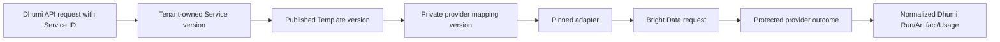

# Dhumi Public API

## Contract status

`PLATFORM-DECISION`

The current accepted Demo Production HTTP contract is
[openapi.yaml](openapi.yaml), with 39 operations. It retains four accepted
Marketplace sample/enquiry additions and removes the three customer API-key
operations as the declared 0070 exception. Browser-session customer access is
implemented. Migrations 0070–0075 are applied in local dhumi_test. User-only
authentication, organizations, transaction authorization/browse, activity and
the matching frontend use that refactored schema. The owner requested an
explicit temporary no-OTP demo on 8 October; see the organization behavior
below and [the runbook](../../docs/runbooks/demo-no-otp.md). Real email proof,
provider traffic and hosted deployment retain their separate readiness gates.
The older Project Specs YAML is a retained snapshot, not client-generation
authority. The current contract is intentionally smaller than the older platform
API: there are no activation, plan, subscription, billing, quota or customer-webhook routes. Acceptance does not enable live Bright
Data traffic; launch gates still control provider egress.

The OpenAPI document is the machine contract. This file explains behavior and does not silently add routes or fields.

## API rules

- Base path: `/v1`.
- JSON property names: `snake_case`.
- Browser clients use a short-lived Dhumi access token/session plus CSRF protection on state-changing browser requests.
- Customer API-key authentication and secret-response recovery are retired.
  Retired keys fail browser authentication with the generic `401` response.
- A customer never supplies `tenant_id` in a normal customer request.
- `X-Dhumi-Organization` selects an organization per protected request. The
  server checks active user, organization and membership; the header confers no
  authority. One active membership permits omission, several require selection,
  and no membership returns the organization-membership error on organization
  operations. Signed-in catalogue/sample browsing needs no organization for
  all-access templates; selected templates need an authorized selector and access
  assignment. Session tokens carry only user/session claims. Public status ignores this selector.
- Existing Service/Run/catalogue/usage collections use bounded cursor pagination. Organization/member/invite lists use their declared collection shapes.
- All accepted asynchronous runs return `202` and a Dhumi `run_id`.
- Mutating create/action requests declare `Idempotency-Key` where the contract requires it.
- Errors use `application/problem+json` with a stable Dhumi code and `request_id`.
- Responses never contain a Bright Data key, provider dataset ID, snapshot ID, zone or raw provider error.

## Endpoint groups

### Authentication

| Method | Path | Purpose | Provider call |
|---|---|---|---|
| `POST` | `/v1/auth/signup` | Create only the local User, legal evidence and audit; reject duplicate email | Never |
| `POST` | `/v1/auth/sign-in` | Authenticate a User and create session/token family | Never |
| `POST` | `/v1/auth/refresh` | Rotate/refresh Dhumi session | Never |
| `POST` | `/v1/auth/logout` | Revoke current Dhumi session family | Never |

`PENDING-VERIFICATION`: real ACS/inbox proof and production signup/recovery approval remain deployment gates. Organization proof and OTP-only reset are implemented in source; remaining MFA policy is not implemented.

On the owner's 8 October correction, a fresh signup request for a registered
email returns `409 ACCOUNT_ALREADY_EXISTS` with sign-in/password-support copy.
It never overwrites the password or legal evidence. `IDEMPOTENCY_CONFLICT` remains
a distinct `409` for a reused key with a different canonical request. Successful
same-key and historical accepted receipts retain `202`; recorded duplicate
rejections replay `409`. See [the accepted design](../../docs/specs/duplicate-signup-design.md).
`workspace_name` is optional, deprecated and ignored. Signup creates no
organization, membership, OTP or notification outbox. Legal evidence records a
server-generated UUID trace; the caller's correlation ID remains the response
`X-Request-ID`. A completed historical signup claim can replay with its exact
v1 request hash; new claims use v2 without the workspace. Sign-in and refresh
require no organization membership.

Refresh reads the HttpOnly cookie and required `X-CSRF-Token`, preserves the
session's absolute expiry, and returns the same four-field `AuthSession` shape
as sign-in while rotating the cookie. A rotated token presented again revokes
the complete session family and records audit/security-outbox evidence. Missing,
invalid, expired, revoked and reused tokens share the generic `401` response;
CSRF failures use the declared `403`. Organization suspension or membership
changes do not destroy a user session; organization access is checked separately.

### Workspace

| Method | Path | Purpose |
|---|---|---|
| `GET` | `/v1/workspace` | Return the Tenant resolved from authenticated identity |

The path uses the authorized organization selected by the optional header.
Signup users cannot access a workspace until they join or create an organization.
Workspace adds the member/admin role. The organization schema is applied in
dhumi_test; create/join follows the selected normal or temporary demo mode.

### Catalogue

| Method | Path | Purpose | Provider call |
|---|---|---|---|
| `GET` | `/v1/catalog/templates` | List published Dhumi templates | No; cached database read |
| `GET` | `/v1/catalog/templates/{slug}` | Read public schema/availability | No |

The response family is `marketplace_dataset` or `scraper_library`. Each
immutable public Template version exposes safe Dhumi-owned `presentation`,
`configuration_schema` and per-Run `input_schema` fields. Presentation uses an
approved frontend `icon_key`, never a provider-hosted URL. Private provider
mappings are never serialized.

Catalogue list/detail and stored-sample preview/query require an active signed-in
user, without requiring organization membership. With no organization selector,
only all-access templates are visible, even if the user has several memberships.
A supplied selector is authorized against current membership; selected templates
also require that organization's template-access assignment. Existing publication,
evidence, sample expiry, masking and bounded query rules remain. POST sample
queries retain session CSRF; no provider request is made by stored-sample queries.
Sample downloads and expert enquiries still require an organization.

Protected resource repositories bind both the authenticated user and organization
and recheck active access within each resource transaction. Ordinary writes lock
the active organization FOR SHARE, then its active membership FOR SHARE, through
commit/rollback. Protected reads use plain checks. These short transactions end
before storage/provider network calls. Membership administration/suspension's
exclusive lock protocol and PostgreSQL concurrency proof remain in the next
organization/qualification work; source-level checks do not prove database races.

### Marketplace pre-purchase operations

| Method | Path | Purpose |
| --- | --- | --- |
| GET | /v1/catalog/templates/{slug}/sample | Read a governed stored sample |
| POST | /v1/catalog/templates/{slug}/sample/query | Filter/project/page the stored sample locally |
| POST | /v1/catalog/templates/{slug}/sample/downloads | Authorize a bounded masked JSON/CSV sample copy |
| POST | /v1/catalog/templates/{slug}/expert-enquiries | Create a Tenant-owned enquiry, not payment or execution |

Use the browser-session authentication, CSRF rules, bounds and required idempotency
headers declared by OpenAPI. Match counts are sample-relative, not proof of
full provider coverage. Masked fields cannot be queried/sorted to infer values.
Structured contact modes are safe catalogue projections; unavailable modes
remain unavailable. These routes create no provider Search/Filter request,
entitlement or paid export. Purchase/contact fulfillment remain gated.
CSV is spreadsheet-oriented and formula-neutralized; JSON preserves values.

### Services

| Method | Path | Purpose |
|---|---|---|
| `GET` | `/v1/services` | List tenant-owned saved configurations |
| `POST` | `/v1/services` | Create a Service from a published Template |
| `GET` | `/v1/services/{service_id}` | Read one tenant-owned Service |

Updating Service configuration is deferred. A new immutable Service version will require an explicit `PATCH` contract before implementation.

### Runs and results

| Method | Path | Purpose |
|---|---|---|
| `POST` | `/v1/services/{service_id}/runs` | Admit and queue one provider-backed Run |
| `GET` | `/v1/runs` | List tenant Runs, optionally filtered by `status` and/or `service_id` |
| `GET` | `/v1/runs/{run_id}` | Read current Dhumi state |
| `POST` | `/v1/runs/{run_id}/cancel` | Request best-effort cancellation |
| `POST` | `/v1/runs/{run_id}/retry` | Create a new controlled Run only from a terminal retryable Run |
| `GET` | `/v1/runs/{run_id}/events` | Read customer-safe Run history |
| `GET` | `/v1/runs/{run_id}/result` | Return authorized result metadata/download URL when ready |

Retry is a new Dhumi Run with a new Run ID and its own idempotency key. It never means blindly repeating an unresolved provider Attempt.

Run-list cursors are bound to both optional filters; a cursor from another
`status` or `service_id` query is rejected. The result endpoint reads only a
ready Dhumi Run. `representation=normalized` is the default and selects the
validated normalized Artifact; `representation=raw` selects the durable raw
Artifact. Invalid representation is rejected. Neither option calls Bright Data.
If the approved private object-storage signer is unavailable, result download
fails honestly with `503 SERVICE_UNAVAILABLE`; no placeholder URL is returned.
After a real signer succeeds, Dhumi reauthorizes the Run/Artifact and commits
the required actor-bound download-authorization audit before returning the URL.
The audit never contains the URL, signature, object key, checksum or result.

### Informational usage

| Method | Path | Purpose |
|---|---|---|
| `GET` | `/v1/usage/summary` | Tenant usage totals over a bounded time range |
| `GET` | `/v1/usage/events` | Paginated tenant usage events |

There is no remaining quota, customer credit, plan or subscription field.

### Status

| Method | Path | Purpose |
|---|---|---|
| `GET` | `/v1/status` | Dhumi platform and enabled-product status without secret/account details |

This is not Bright Data's Account Management `GET /status` operation.
The request is intentionally unauthenticated and accepts no Tenant or product
selector. It reads Dhumi's stored release projection and never performs a
request-time Bright Data or private-dependency health call. Product states are
derived from current feature, publication, mapping, evidence, adapter and
credential-release metadata; they do not expose those private inputs. Platform
state reports the status/control surface separately from product availability.

## Translation boundary



The public request never contains `dataset_id`, `snapshot_id`, credential reference or adapter URL.

## Error model

Terminal Run responses use the existing nullable `error_code` string.
`ALL_INPUTS_FAILED` means the durable raw result contains only error records;
`PROVIDER_TIMEOUT` means the bounded provider polling deadline expired.
Both appear on a Run whose public status is `failed`. They are Run outcomes,
not new HTTP problem statuses. Raw provider diagnostics remain private.

Example:

```json
{
  "type": "https://api.dhumi.example/problems/validation-error",
  "title": "Request validation failed",
  "status": 422,
  "detail": "One or more fields are invalid.",
  "instance": "/v1/requests/req_01J...",
  "code": "VALIDATION_ERROR",
  "request_id": "req_01J...",
  "errors": [
    {"field": "input.url", "message": "A valid supported URL is required."}
  ]
}
```

| HTTP | Stable Dhumi code | Meaning |
|---:|---|---|
| 400 | `BAD_REQUEST` | Malformed request/header |
| 400 | `ORGANIZATION_REQUIRED` | Several active memberships require an organization selector |
| 401 | `AUTHENTICATION_REQUIRED` | Missing/invalid/expired Dhumi credential |
| 403 | `ACCESS_DENIED` | Authenticated but not authorized, tenant suspended or CSRF invalid |
| 403 | `ORGANIZATION_MEMBERSHIP_REQUIRED` | No active organization membership for an organization operation |
| 404 | `RESOURCE_NOT_FOUND` | Resource absent or not visible to this Tenant |
| 409 | `IDEMPOTENCY_CONFLICT`, `STATE_CONFLICT`, `ACCOUNT_ALREADY_EXISTS` | Same key/different body, illegal current state, or duplicate signup email |
| 413 | `PAYLOAD_TOO_LARGE` | Request body exceeds the accepted one-mebibyte limit |
| 415 | `UNSUPPORTED_MEDIA_TYPE` | Request body does not use a supported media type |
| 422 | `VALIDATION_ERROR`, `SERVICE_INPUT_INVALID` | Semantically invalid input |
| 429 | `PLATFORM_CAPACITY_LIMIT` | Global/product capacity is temporarily full; not a customer quota |
| 500 | `INTERNAL_ERROR` | Unexpected Dhumi error |
| 503 | `SERVICE_UNAVAILABLE` | Adapter, credential, provider account or global spend circuit unavailable |

Provider errors are mapped to these stable codes. Do not expose `402 insufficient provider funds` as a customer payment problem; in the shared-account demo it becomes a Dhumi service incident and `503`.

## Versioning

- Breaking public changes require `/v2`.
- The planned in-place refactor declares customer API-key removal and the later
  signup organization change as exceptions before the compatibility baseline.
  Customer API-key removal and user-only signup are implemented in source;
  Organization/proof/reset/member/invite and frontend source are implemented;
  0071 grant/RLS, PostgreSQL qualification/application and runtime activation remain pending.
- Additive optional response fields are allowed in `/v1`; clients must ignore unknown fields.
- Removal/rename/type/status/auth changes require a new major API version.
- Deprecation must publish `Deprecation`, `Sunset` and successor links with an approved notice period.
- Provider endpoint changes do not require a Dhumi API version when the public contract remains stable; they require a new adapter/provider-mapping version and tests.

## Organization workflows for 0071

| Method | Path | Result |
| --- | --- | --- |
| GET | /v1/organizations | Active organizations and caller role |
| POST | /v1/organizations | Normal: 202 pending proof; demo: 201 immediate organization |
| POST | /v1/invites/accept | Normal: 202 fresh proof; demo: 200 immediate join; exactly one join_code or invite_token |
| POST | /v1/auth/password-reset | Normal: generic 202 with verification_id; demo: 403 unavailable |
| POST | /v1/verifications/{verification_id}/confirm | Normal: create/join same browser user plus CSRF or reset proof; demo: 403 unavailable |
| POST | /v1/verifications/{verification_id}/resend | Normal: new challenge; demo: 403 unavailable |
| GET | /v1/organization/members | Safe profiles for active members |
| PATCH | /v1/organization/members/{user_id} | Admin role change; creator/last-admin protection |
| DELETE | /v1/organization/members/{user_id} | 204, row retained as removed |
| GET | /v1/organization/invites | Admin metadata; no token/hash |
| POST | /v1/organization/invites | 201 single-use email invite or reusable code; future expiry |
| DELETE | /v1/organization/invites/{invite_id} | 204 revocation |
| POST | /v1/organization/invites/{invite_id}/resend | Rotate token; old pending join fingerprint fails |

Mutations require Idempotency-Key; signed-in mutations require session CSRF.
With the explicit non-production `DEMO_DISABLE_OTP=true` switch, create/join
return `confirmed`, `organization_id` and `verification_skipped: true` without
a pending OTP or email delivery. Invitation email matching, expiry, revocation,
use counting and role protection still apply. Share the minted link/code
manually. Mailbox verification is unchanged and audits record the demo bypass.
Password reset and proof endpoints are unavailable instead of allowing
proofless account recovery. The switch defaults to false and production rejects it.

In normal mode, proof lasts ten minutes with five failed attempts. Failed counters commit before
the error; resend requires 60 seconds and permits five issues/hour across purposes.
Previously verified users still need fresh proof for a second organization/rejoin.
An active join keeps its role without extra uses. Reset revokes every active session
family and outstanding challenge and requires sign-in again.

Email sends directly after commit. No secret enters an outbox or response envelope.
Invitation secrets appear only at first minting; replay returns metadata and explicit
Resend rotates a fresh token. Browser proof/replay state is memory-only. Link secrets
use cleared URL fragments; GET/scanners never confirm. The URL selects an organization
per tab. Selection resumes the same screen without automatically starting a Run.
Activity is implemented on the applied 0073–0075 schema.
