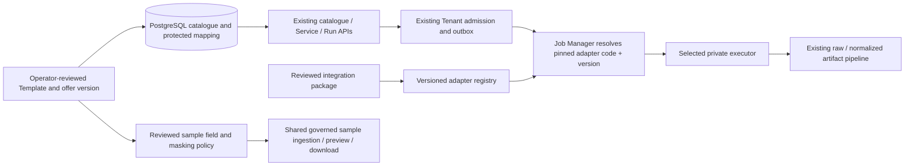

# ADR-0014: Versioned extension contract for scrapers and Marketplace offers

Status: **proposed for owner review**, 2026-09-18. No runtime change or provider call is authorized by this document.

Implementation update: the owner subsequently authorized the **shared scraper
processing foundation**. It is implemented and verified offline, opt-in and
unactivated on operational databases. The shared release identity and
commercial admission/worker recheck are also implemented without publishing a
retailer. Marketplace offer/sample generalization and generic protected
retailer qualification/publication are still proposed follow-ups. Read
the [onboarding and verification runbook](../runbooks/scraper-operation-onboarding.md)
for the actual implemented boundary; this proposal is not proof that all its
acceptance criteria or retailer qualifications have been completed.

## Context and requirements

The customer-facing paths for catalogue, Services, Runs, events, results and stored-sample preview are already shared. Adding another approved operation should not require a new public route, Tenant flow, job engine, result store or frontend page. Each operation may legitimately have different input fields, provider parameters, output fields, normalization, preview masks and rights.

Today extension is not uniformly data-driven:

- The Amazon registry contains 13 definitions, but only four precise output contracts. Qualification and publication are independently required for each operation.
- The worker router and plan resolver recognize exactly Amazon and Marketplace adapter identities.
- The Marketplace importer, repository and migration `0045` pin two LinkedIn offers and an exact-two candidate import.
- Posts and People sample ingestion each pin their own evidence and policy, but repeat immutable upload/receipt/manifest mechanics.
- The disabled M7 Marketplace adapter version in migration `0052` pins a digest of an ordered source set **including the existing router**. Editing the router in place would break the source-integrity test and misrepresent that version's recorded artifact.

The desired developer experience is **add a reviewed operation/offer package**, specifying its inputs, output contract and custom provider behavior, without editing customer API routes or copying the durable Run machinery. “Dynamic” does not mean customer-supplied provider endpoints or automatic publication of arbitrary catalogue entries.

### Non-functional requirements

- Preserve Tenant/RLS isolation, restricted operator review, immutable Template/Adapter/mapping versions, fenced attempts, raw-before-parse storage, audit and idempotency.
- Unknown, disabled, mismatched or unqualified adapter identities fail **before** secret resolution or provider egress.
- A new integration has zero effect on existing published Template versions and pinned Services until an explicitly reviewed pointer change.
- No new always-on service, database technology or dependency is required merely to add an integration.
- Fixture/controlled tests and a clean-clone migration test must exercise the extension without a billable call. Live qualification remains separately authorized per operation.
- Record size, poll time, concurrency and cost policy remain bounded by the accepted product and provider evidence; no new numeric target is invented here.

## Decision proposed

Use a **code-backed, versioned adapter registry** plus **operator-reviewed, versioned Template/offer definitions in PostgreSQL**. Keep the existing public API and durable execution ports.

1. A scraper integration package supplies a stable internal adapter code/version; the exact provider request serializer, lifecycle interpreter and result normalizer; and fixture tests. A Template version supplies its public presentation, saved configuration schema, per-Run input schema, output schema/version and launch-evidence reference. The provider dataset/scraper ID stays in a protected mapping, not in the public package.
2. The worker resolves the pinned adapter **code and version identity** under the existing fence and selects only an explicitly registered executor. The registry is closed at process startup. Unknown pairs, disabled versions and missing executors return a safe terminal configuration failure; they never fall through to another adapter.
3. Operations using an already supported provider protocol may share one executor, but each has its own reviewed input serializer contract and output normalizer contract. A different provider protocol supplies a small module implementing the existing execution port; it does not fork admission, tenancy, outbox, Run lifecycle, artifact or download code.
4. The Marketplace catalogue importer uses an approved-offer definition source rather than exact Posts/People branches. Provider list/metadata reads still produce **private candidates** only. A restricted operator reviews each candidate, rights, approved public fields, masks, retention and Template version before any customer-visible publication. A new offer does not gain execution by appearing in provider search results.
5. A governed sample policy is per dataset and version: metadata dictionary, permitted display/query/sort/download fields, pre-purchase masks, rights reference, provenance and retention. A shared ingestion engine performs bounded immutable upload, checksum/readback, durable reservation/manifest commit and orphan reconciliation. Dataset-specific policy never becomes a generic “unmask” flag.
6. Public forms and sample tables read the approved Template/field metadata. Different input/output shapes are expected. No provider credentials, IDs, request URLs or arbitrary provider parameters are accepted from the browser.

## Extension package contract

These are design roles, not a new public JSON payload:

| Part supplied by an integrator | Required evidence/check | Shared code that must not be copied |
| --- | --- | --- |
| Stable operation/offer identity and adapter code/version | Unique, immutable and internally approved | Catalogue list/detail routes |
| Saved-Service configuration and per-Run input schemas | Deterministic pre-admission validation; no private IDs | Service creation, Run admission and idempotency |
| Provider serializer and fixed private mapping policy | Exact qualified request and timeout/retry/cancel semantics | Secret boundary and Job Manager fencing |
| Output schema and normalizer version | Real/fixture response evidence; raw bytes retained; strict normalization | Artifact storage, signed download and usage finalization |
| Marketplace field dictionary, sample mask and rights policy | Explicit storage/display/query/download scope and retention | Generic sample preview/query/download APIs |
| Tests and release packet | Unknown adapter, wrong Tenant, missing evidence, duplicate delivery, malformed input/output and old-version regression | Full customer route/worker stacks |

For another operation on a **known protocol**, this should be a reviewed descriptor/serializer/normalizer plus evidence and an immutable version—not a worker/router edit. For a **new protocol**, one executor module and one explicit registration are additionally necessary. Arbitrary unknown protocols cannot be made safe through data-only configuration.

### Acceptance criteria for the refactor

- Add an unpublished operation on a supported scraper protocol by supplying only its integration package, approved schemas, protected mapping and qualification evidence. No edit to the customer routes, Service/Run/admission flow, Job Manager dispatch or artifact pipeline is required.
- Add an unrelated scraper protocol with one new executor module and one explicit registry entry. Its absence or disablement fails closed; it never selects the Amazon or Marketplace executor by fallback.
- Import a third Marketplace offer as a **private disabled fixture** without editing the importer, repository union or an applied migration for that offer's identity. Import alone never publishes it, starts a Run or makes a provider POST.
- Keep an old pinned Service operational after a newer adapter or Template version is installed. Verify exact historical input/output behavior and no cross-version fallback.
- Demonstrate that a new operation can have different input parameters, output fields, normalizer, sample masks and retention without changing the shared Tenant, Run, artifact or result APIs.
- Pass a clean-clone forward-migration and fixture-only regression with **zero Bright Data calls** before any independently authorized live qualification.

## Backward-compatible rollout

1. **Correct and characterize existing boundaries first.** Close the known source-sample orphan, Marketplace HTTP/schema/filter parity and Amazon admission/serializer disagreement. Freeze Amazon v4 and Posts/People request/response, error, masking, version-pinning and raw/normalized fixtures. No provider call is needed.
2. **Introduce a manifest validator and extension recipe.** Validate unique code/version, schemas, public/private separation and required fixture/evidence fields offline. Use current Amazon and LinkedIn packages as characterization cases. This stage may add code but changes no published pointer or runtime dispatch.
3. **Version the dispatcher without rewriting M7 evidence.** Leave the source files covered by migration `0052` untouched. Add a new dispatcher module and a forward-only adapter version/evidence record with its own source digest. Resolve pinned adapter code **and version** through a new fenced read function; register every immutable Amazon identity explicitly—including the published `1.1.0-pattern8-release` identity—and keep customer Marketplace execution absent. The compatibility list is checked against migrations `0032`, `0040` and `0041`. Only switch Job Manager after equivalence and unknown-code tests pass.
4. **Generalize the Marketplace offer administration path.** In a forward-only migration, seed the two existing reviewed offers into a restricted, versioned offer-definition source. Replace exact-two SQL/TypeScript branches with approved-record lookups under operator privileges, preserving their current public projections. Test a third **disabled fixture** through import/review without publishing or executing it.
5. **Share sample mechanics after reconciliation exists.** Keep Posts/People policy modules distinct while reusing storage/manifest/expiry mechanics. Prove ambiguous DB commit, restart, checksum and orphan cleanup cases with disposable storage.
6. **Release integrations independently.** Run mandatory clean-clone, RLS, API contract, adapter fixture, worker fencing and result-byte regression. Create new immutable Template and protected mapping versions; advance a public pointer only with approval. Existing Services remain pinned. A real provider call is a separate bounded authorization.

Every phase should be a small change that can be reverted or left disabled without data loss. Do not edit applied migration `0052` or mutate existing Template versions to make the source digest/test pass.

## Failure modes and mitigations

| Failure | Required behavior |
| --- | --- |
| Unknown adapter code/version or missing executor | Fail closed, safe customer error, zero secret access/provider calls |
| Candidate imported without rights, schema or qualification | Remain private/unpublished; no public pointer or Run eligibility |
| Provider payload violates its pinned contract | Retain bounded raw evidence, fail safely; do not silently normalize another operation's shape |
| Source sample upload succeeds but manifest commit fails/ambiguous | Reconcile via durable reservation and authoritative manifest check; do not blindly delete a possibly committed object |
| Old and new versions coexist | Route by pinned code/version; old Services continue on old contract |
| Provider submission outcome is uncertain | Reconcile; never automatically repeat a potentially billable POST |
| Purchased/unmasked data requested before entitlement | Reject before work/download; pre-purchase sample remains masked |

## Alternatives considered

- **Arbitrary database-defined HTTP requests and transforms:** superficially “zero code,” but allows unreviewed endpoints, data leakage and billing behavior. Rejected.
- **Separate backend service per scraper or dataset:** duplicates Tenant/Run/security/result logic and increases operations. Rejected for this scale.
- **Keep exact-site `if`/`CASE` branches everywhere:** simple for two offers, but adding each integration requires scattered edits and invites drift. Retain only until the versioned replacement passes parity tests.
- **Big-bang rewrite of the existing router and Marketplace SQL:** faster-looking code diff, but breaks a pinned M7 source digest and risks existing Services. Rejected.

## Consequences

- **Positive:** new same-protocol operations can add local contracts and evidence without customer-route or core-Run edits; new provider protocols have one deliberate registration point; catalogue and samples remain governed.
- **Negative:** code-backed protocol modules and separate qualification are still required; the forward-only SQL transition and legacy parity tests are nontrivial; registry/version compatibility must be maintained.
- **Neutral:** frontend forms remain schema-driven, but rich operation-specific widgets may need optional, reviewed UI renderers; that does not change backend provider authority.

## Review requested before runtime implementation

Confirm that “dynamic” means **reviewed code modules for new provider behavior plus operator-managed Template/offer metadata**, not customer- or database-authored arbitrary provider requests. The owner should also confirm whether the first acceptance target is (a) another Amazon operation, (b) another Bright Data Scraper site, or (c) a third Marketplace dataset. The first fixture drives the parity test without authorizing a live or billable call.

## References

- `Project Specs/02_Architecture/03_Service_Adapter_Architecture.md` — accepted common adapter contract.
- `Project Specs/docs/adr/0007-restricted-catalogue-administration.md` and `0011-full-amazon-scraper-library-scope.md` — review and per-operation release gates.
- `back-end/src/services/brightdata/providerRunExecutorRouter.ts`, `providerExecutionPlanRepository.ts`, `back-end/src/worker/jobManager.ts` — current two-way dispatch.
- `back-end/src/services/marketplaceCatalogue/marketplaceCatalogueService.ts`, `marketplaceCatalogueRepository.ts`, `back-end/scripts/migrations/0045_marketplace_catalogue_import.sql` — current exact-two offers.
- `back-end/scripts/migrations/0052_marketplace_filter_adapter_fixture.sql` and `back-end/tests/unit/marketplace-filter-adapter-migration.test.ts` — pinned source digest.
